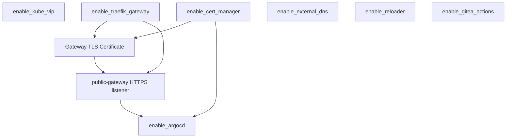

# terraform-kubernetes-bootstrap

Terraform module that bootstraps a Kubernetes platform layer (ingress/Gateway,
TLS, GitOps, DNS, and related tooling). Every component is **off by default**;
enable what you need with `enable_*` flags.

Providers (`helm`, `kubernetes`, `kubectl`) are configured by the **caller**.

> **Scope today:** several components assume a Traefik + Gateway API setup and
> (optionally) kube-vip. Traefik is installed from the official Helm chart, so
> on k3s the embedded Traefik must be disabled (`--disable=traefik`). The module
> is named and structured to grow toward any Kubernetes distribution;
> distribution-specific pieces remain behind feature flags.

## Components

| Flag | Component |
|------|-----------|
| `enable_kube_vip` | kube-vip + kube-vip-cloud-provider |
| `enable_traefik_gateway` | Traefik (official Helm chart) + Gateway API (CRDs, GatewayClass, Gateway) |
| `enable_cert_manager` | cert-manager + ClusterIssuers (HTTP-01 + DNS-01) |
| `enable_argocd` | Argo CD + repo secret + bootstrap Application (`directory.recurse: true` on `gitops_path`) |
| `enable_external_dns` | external-dns (GCP) |
| `enable_reloader` | Stakater Reloader |
| `enable_gitea_actions` | Gitea Actions runners |

ClusterIssuers are applied as native `cert-manager.io/v1` manifests (no private Helm chart).

## Dependencies



| Component | Depends on | Why |
|-----------|------------|-----|
| **kube-vip** | — | Independent; needs `vip` / `vip_interface` |
| **Traefik Gateway** | — for HTTP; **cert-manager** for HTTPS Certificate | Installs Gateway API CRDs + Traefik chart; `public_gateway_certificate` only when both flags are true |
| **cert-manager** | — | Needs `acme_email`, `letsencrypt_dns_zones`, `gcp_dns_credentials_json` |
| **Argo CD** | **Traefik Gateway** + **cert-manager** | HTTPRoute + Gateway TLS; plan fails if Argo is enabled without both |
| **external-dns** | — | Needs GCP credentials and domain filters |
| **reloader** | — | No dependencies |
| **Gitea Actions** | — | Needs `gitea_root_url` and registration token |

### Recommended enable order

1. `enable_kube_vip` (if using kube-vip)
2. `enable_cert_manager` + `enable_traefik_gateway`
3. `enable_argocd`
4. `enable_external_dns`, `enable_reloader`, `enable_gitea_actions` (any order)

## Usage (Git source)

Until published to the Terraform Registry:

```hcl
module "bootstrap" {
  source = "git::https://github.com/HobOps/terraform-kubernetes-bootstrap.git?ref=v0.1.0"

  cluster_name = "acme-c1"
  project_id   = "acme-gcp"

  enable_kube_vip        = true
  enable_traefik_gateway = true
  enable_cert_manager    = true
  enable_argocd          = true
  enable_external_dns    = true
  enable_reloader        = true

  vip             = "10.0.0.50"
  argocd_hostname = "argocd.c1.example.com"
  gitops_repo_url = "git@github.com:org/infra.git"
  gitops_path     = "gitops/acme-c1"

  gateway_tls_dns_names       = ["*.c1.example.com"]
  acme_email                  = "ops@example.com"
  letsencrypt_dns_zones       = ["example.com", "*.example.com"]
  external_dns_domain_filters = ["example.com"]

  gcp_dns_credentials_json     = data.sops_file.secrets.data["gcp.dns_credentials_json"]
  argocd_repo_ssh_private_key  = data.sops_file.secrets.data["argocd.repo_ssh_private_key"]
  argocd_admin_password_bcrypt = data.sops_file.secrets.data["argocd.admin_password_bcrypt"]
  argocd_admin_password_mtime  = "2026-01-01T00:00:00Z"
}
```

See [`examples/complete`](examples/complete) for a full thin wrapper (providers, SOPS, backend).

## Requirements

| Name | Version |
|------|---------|
| terraform | >= 1.3 |
| helm | >= 3.0, < 4 |
| kubernetes | >= 2.30, < 3 |
| kubectl | ~> 2.1 |
| http | >= 3.0, < 4 |

## Repository layout

```
.
├── *.tf                 # root module (Registry-compatible)
├── examples/complete/   # example caller stack
├── LICENSE
└── README.md
```

## Versioning

Tag releases with semver (`v0.1.0`, `v1.0.0`, …) so callers can pin `?ref=`
and so the Terraform Registry can publish versions later.
