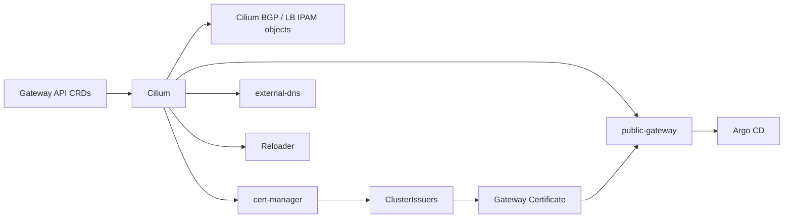

# terraform-kubernetes-bootstrap

Terraform module that bootstraps the platform layer of a Kubernetes cluster:
**Cilium** (CNI, kube-proxy replacement, LoadBalancer IPAM + BGP, Gateway
API), TLS, GitOps, DNS and related tooling. Every component except Cilium is
**off by default**; enable what you need with `enable_*` flags.

Providers (`helm`, `kubernetes`, `kubectl`, `http`) are configured by the
**caller**.

> **v1.0.0 is a breaking release.** It replaces kube-vip and Traefik with
> Cilium. Clusters that use kube-vip, kube-vip-cloud-provider or Traefik from
> this module must stay on `v0.2.0`. See [Upgrading from v0.x](#upgrading-from-v0x).

## Scope and division of responsibilities

| Layer | Owns | Where |
|---|---|---|
| Cluster install (e.g. Ansible + k3s) | Kubernetes, **the API VIP** (kube-vip in ARP, control-plane only, as a k3s manifest) | Outside this module |
| This module | Cilium, LoadBalancer IPs, Gateway API, cert-manager, Argo CD, external-dns, Reloader, Gitea Actions | `terraform apply` |

**kube-vip is not supported by this module.** The Kubernetes API VIP belongs
to the cluster install, before any CNI exists, as the k3s documentation
describes
([Cluster Load Balancer → Kube-VIP](https://docs.k3s.io/datastore/cluster-loadbalancer?ext-load-balancer=Kube-VIP)).
Deploy kube-vip as a DaemonSet that tolerates every taint, uses
`hostNetwork`, sets `cp_enable` and leaves out `svc_enable`; put it in
`/var/lib/rancher/k3s/server/manifests/`. With k3s-io/k3s-ansible that is the
`extra_manifests` inventory variable. The VIP then exists as soon as the
first server starts: the other nodes join through it, and Terraform's
providers use it from the first apply.

**Required change to the k3s example for this module:** the cluster has no
kube-proxy (Cilium replaces it, and it is not running yet), so kube-vip cannot
reach the API through the `kubernetes` Service (10.43.0.1) and never takes the
lease. Add to its container:

```yaml
        env:
        - name: KUBERNETES_SERVICE_HOST
          value: 127.0.0.1   # the local apiserver on each server (in the k3s cert)
        - name: KUBERNETES_SERVICE_PORT
          value: "6443"
```

A server whose apiserver dies then also loses the lease, and the VIP moves.

Do not put the API VIP behind a Cilium LoadBalancer Service:

- **Shared session resets.** Editing a `CiliumBGPPeerConfig` (timers,
  families, graceful restart) resets every node's BGP session at once, so the
  VIP would disappear for a few seconds.
- **Chicken-and-egg with the CNI.** The API would depend on Cilium, which
  needs the API to start (cilium/cilium#29323).

Do not run kube-vip in BGP mode next to Cilium BGP either: both would open a
session from the same node IP to the same router.

## Components

| Flag | Component |
|------|-----------|
| `enable_cilium` (default `true`) | Cilium: CNI, kube-proxy replacement, LB IPAM, BGP control plane (`cilium_bgp`, `cilium_lb_ip_pools`, `cilium_bgp_advertisements`), Gateway API controller |
| `enable_gateway` | Gateway API CRDs, the shared `public-gateway` (class `cilium`, listeners 80/443) and, with cert-manager, its TLS Certificate |
| `enable_cert_manager` | cert-manager (Gateway API support on) + ClusterIssuers (HTTP-01 through the Gateway, DNS-01 on Cloud DNS) |
| `enable_argocd` | Argo CD (HTTPRoute on the shared Gateway) + repo secret + bootstrap Application (`directory.recurse: true` on `gitops_path`) |
| `enable_external_dns` | external-dns (GCP; Services and Gateway HTTPRoutes) |
| `enable_reloader` | Stakater Reloader |
| `enable_gitea_actions` | Gitea Actions runners |

## One apply

On a fresh cluster (installed without a CNI: k3s with `flannel-backend: none`,
`disable-kube-proxy`, `disable-network-policy`; nodes are `NotReady`) a single
`terraform apply` brings everything up. The module orders it internally:


```mermaid
flowchart LR
  CRD[Gateway API CRDs] --> CIL[Cilium]
  CIL --> CR[Cilium BGP / LB IPAM objects]
  CIL --> CM[cert-manager] --> ISS[ClusterIssuers] --> CERT[Gateway Certificate]
  CIL --> GW[public-gateway]
  CERT --> GW
  GW --> AC[Argo CD]
  CIL --> ED[external-dns]
  CIL --> RL[Reloader]
```

- **Gateway API CRDs before Cilium:** Cilium only enables its Gateway API
  controller if the CRDs exist when the operator starts.
- **Cilium's API access:** Cilium reaches the API through
  `cilium_k8s_service_host:cilium_k8s_service_port`. The default is k3s'
  client-side load balancer on every node, `127.0.0.1:6444`, so it does not
  depend on the VIP.
- **Workloads wait for Cilium:** everything that runs pods depends on
  `helm_release.cilium`.
- **Other modules in the same stack** that deploy workloads (e.g. monitoring)
  should use `depends_on = [module.bootstrap]`.

| Component | Depends on | Why |
|-----------|------------|-----|
| **Cilium** | Gateway API CRDs (if `enable_gateway`) | Gateway API controller |
| **Gateway** | Cilium; cert-manager for HTTPS | Class `cilium`; TLS Certificate |
| **cert-manager** | Cilium | Pods; HTTP-01 via the Gateway |
| **Argo CD** | Gateway + cert-manager | HTTPRoute + Gateway TLS; plan fails if Argo is enabled without both |
| **external-dns**, **Reloader**, **Gitea Actions** | Cilium | Pods |

## Usage (Git source)

```hcl
module "bootstrap" {
  source = "git::https://github.com/HobOps/terraform-kubernetes-bootstrap.git?ref=v1.0.0"

  cluster_name = "acme-c1"
  project_id   = "acme-gcp"

  # Cilium (always on). Cluster-specific Helm values:
  cilium_values = {
    devices               = ["eth0"]
    routingMode           = "native"
    autoDirectNodeRoutes  = true
    ipv4NativeRoutingCIDR = "10.42.0.0/16"
    encryption            = { enabled = true, type = "wireguard" }
  }
  cilium_bgp = {
    local_asn = 64620
    peers = [
      { name = "router-v4", address = "10.0.0.1", asn = 65101, families = ["ipv4"] },
    ]
  }
  cilium_lb_ip_pools = {
    gateway = {
      blocks           = ["10.0.0.29/32"]
      service_selector = { matchLabels = { "lb-pool" = "gateway" } }
    }
  }
  cilium_bgp_advertisements = {
    lan = [{
      advertisementType = "Service"
      service           = { addresses = ["LoadBalancerIP"] }
      selector          = { matchLabels = { "lb-pool" = "gateway" } }
    }]
  }

  enable_gateway         = true
  gateway_infrastructure = { labels = { "lb-pool" = "gateway" } }
  enable_cert_manager    = true
  enable_argocd          = true
  enable_external_dns    = true
  enable_reloader        = true

  argocd_hostname = "argocd.c1.example.com"
  gitops_repo_url = "git@github.com:org/infra.git"
  gitops_path     = "gitops/acme-c1"

  gateway_tls_dns_names       = ["*.c1.example.com"]
  acme_email                  = "ops@example.com"
  letsencrypt_dns_zones       = ["example.com", "*.example.com"]
  external_dns_domain_filters = ["example.com"]

  gcp_dns_credentials_json     = data.sops_file.secrets.data["gcp.dns_credentials_json"]
  argocd_repo_ssh_private_key  = data.sops_file.secrets.data["argocd.repo_ssh_private_key"]
  argocd_admin_password_bcrypt = data.sops_file.secrets.data["argocd.admin_password_bcrypt"]
  argocd_admin_password_mtime  = "2026-01-01T00:00:00Z"
}
```

See [`examples/complete`](examples/complete) for a full thin wrapper (providers, SOPS, backend).

### Cilium BGP notes

- **No BFD** in Cilium OSS (1.20). Failure detection is the hold timer:
  defaults 3/9 s, minimum 1/3 s.
- **Shared session resets.** Changing `cilium_bgp` timers, families or
  graceful restart resets every node's session at once. Changing pools or
  advertisements does not.
- **Graceful restart:** `graceful_restart_seconds` makes the router keep
  routes during those resets. It also keeps a dead node's routes until the
  restart time expires.
- **Fixed IPs:** a Service (or the Gateway via `gateway_infrastructure`)
  picks a pool by label and a fixed IP with the `lbipam.cilium.io/ips`
  annotation.

## Upgrading from v0.x

v1.0.0 removes:

- `enable_kube_vip`, `vip`, `vip_interface` and the kube-vip /
  kube-vip-cloud-provider releases. Move the API VIP to the cluster install
  (see [Scope](#scope-and-division-of-responsibilities)).
- `enable_traefik_gateway`, `traefik_load_balancer_ip` and the Traefik release
  and GatewayClass. Use `enable_gateway`; the Gateway's class is `cilium`
  and its listeners are on 80/443.
- `chart_versions.kube_vip`, `kube_vip_cloud_provider` and `traefik`
  (`chart_versions.cilium` added).

It also changes:

- `gateway_api_version` now defaults to `v1.6.1`.
- The module now creates the Gateway namespace (`create_gateway_namespace`).
- The HTTP-01 ClusterIssuer solves through the Gateway (`gatewayHTTPRoute`),
  not an Ingress class.

Switching a running cluster's CNI is a reinstall: build the cluster without a
CNI and apply v1.0.0. Clusters that keep kube-vip/Traefik pin `?ref=v0.2.0`.

## Requirements

| Name | Version |
|------|---------|
| terraform | >= 1.3 |
| helm | >= 3.0, < 4 |
| kubernetes | >= 2.30, < 3 |
| kubectl | ~> 2.1 |
| http | >= 3.0, < 4 |

## Repository layout

```
.
├── *.tf                 # root module (Registry-compatible)
├── examples/complete/   # example caller stack
├── LICENSE
└── README.md
```

## Versioning

Tag releases with semver (`v0.1.0`, `v1.0.0`, …) so callers can pin `?ref=`
and so the Terraform Registry can publish versions later. Releases are cut by
CI from Conventional Commits on `main`; breaking changes use `feat!:` or a
`BREAKING CHANGE:` footer.
